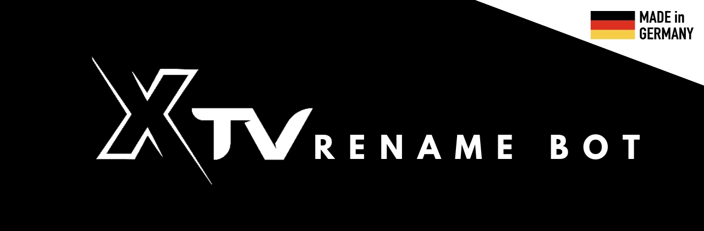

# 𝕏TV MediaStudio™ 🚀

> **Business-Class Media Management Solution**
> *Developed by [𝕏0L0™](https://t.me/davdxpx) for the [𝕏TV Network](https://t.me/XTVglobal)*

<p align="center">
  
</p>

⚠️ **ATTENTION:** This branch (`torrent-edition`) installs `aria2c` and contains Torrent features. **DO NOT** host on Railway, Render, or Heroku (Risk of Ban!). This version is strictly intended for your own Root Servers (VPS/Dedicated)!


<p align="center">
  <a href="https://www.python.org/"></a>
  <a href="https://docs.pyrogram.org/"></a>
  <a href="https://ffmpeg.org/"></a>
  <a href="https://www.mongodb.com/"></a>
  <a href="https://www.docker.com/"></a>
  <a href="https://github.com/davdxpx/XTV-MediaStudio/blob/main/LICENSE"></a>
</p>

The **𝕏TV MediaStudio™** is a high-performance, enterprise-grade **Telegram Bot** engineered for automated media processing, file renaming, and video metadata editing. It combines robust **FFmpeg** metadata injection with intelligent file renaming algorithms, designed specifically for maintaining large-scale media libraries on Telegram. Whether you need an **automated media manager**, a **TMDb movie scraper**, or a **video metadata editor**, 𝕏TV MediaStudio™ is the ultimate **media management solution**.

---

### 📋 What's New in v1.5.1
*   **Migration to Pyrofork**: The underlying Telegram framework was migrated from Pyrogram to Pyrofork, enabling the usage of modern Telegram API Layer features.
*   **Expandable Quotes**: Added native support for `<blockquote expandable>` for long text fields (e.g. inside `/help`).
*   **System Info Refactor**: Added detailed system info natively in the `/info` menu.
*   **Robust Peer Caching**: Fixed pesky `PeerIdInvalid` errors. The bot now explicitly forces a re-cache by fetching the chat when channels are not found dynamically!
  
<details>
<summary><b>📋 What's New in v1.5.0</b></summary>
• The biggest update in 𝕏TV history — 77 pull requests, a full rebrand, and an entirely new product.

- **🏷️ Rebrand:** XTV Rename Bot is now **𝕏TV MediaStudio™** — new name, new identity, new era
- **📁 MyFiles V2.0 — Endgame Evolution:** Personal cloud storage with auto-folders, custom folders, batch multi-select actions, season grouping, Netflix-style TMDb poster dashboard, inline query search (`@bot query`), system filename templates, dynamic sorting, and privacy settings
- **💎 Premium System Overhaul:** Multi-tier plans (Standard ⭐ / Deluxe 💎), Telegram Stars payments, PayPal, Crypto (USDT/BTC/ETH), UPI, automated trial system, priority queue, and per-plan feature overrides
- **📡 Dumb Channel Auto-Routing:** Automatic Movie / Series / Default channel routing based on TMDb detection
- **🎯 Unified Destination Menu:** Folder + channel selection combined in a single paginated UI
- **🖼️ Thumbnail Mode Preferences:** None / Auto / Custom modes configurable per user and globally
- **🔧 Global Feature Toggles:** Admin can enable/disable resource-heavy tools globally, with premium cascade overrides
- **📺 Season & Episode Detection:** Multi-episode file support and improved parsing accuracy
- **✏️ Edit Instead of Send UX:** Admin configuration prompts now edit messages in-place for a cleaner chat
- **🗂️ Major Codebase Refactor:** Core processing extracted to `tools/` directory, pre-processing separated into standalone modules
- **📖 Start Menu & Help Guide Overhaul:** Redesigned interactive starter setup, expandable troubleshooting sub-menus, and categorized help sections
- **⚡ Performance:** Persistent HTTP sessions, database settings cache (60s TTL), programmatic MongoDB indexes, async file cleanup
- **🔒 Security:** SSL bypass removed, config validation on startup, FFmpeg metadata sanitization
- **🧹 Reliability:** State TTL auto-cleanup, queue memory leak fix, graceful shutdown, robust subprocess cleanup with disk checks
- **🎨 UI Polish:** 150+ back-button labels standardized with contextual `← Back to [Page]` format
- **🏗️ Infrastructure:** Ruff linter, GitHub Actions CI, pinned dependencies, Dockerfile optimization
</details>  

---

## 📑 Table of Contents

- [🌟 Core Features](#-core-features)
- [💎 Premium & Payment System](#-premium--payment-system)
- [⚙️ Configuration (.env)](#️-configuration-env)
- [🚀 𝕏TV Pro™ Setup (4GB File Support)](#-xtv-pro-setup-4gb-file-support)
- [🌍 Public Mode vs Private Mode](#-public-mode-vs-private-mode)
- [🛠 Deployment Guide](#-deployment-guide)
- [🎮 Usage Commands](#-usage-commands)
- [🧩 Credits & License](#-credits--license)

---

## 🌟 Core Features

### 🔹 Advanced Processing Engines
*   **𝕏TV Core™**: Lightning-fast processing for standard files (up to 2GB) using the primary bot API.
*   **𝕏TV Pro™: Ephemeral Tunnels**: Seamless integration with a Premium Userbot session to handle **Large Files (>2GB up to 4GB)**. The system generates secure, temporary private tunnels for every single large file transfer, bypassing API limits, cache crashing, and `PEER_ID_INVALID` errors.
*   **Concurrency Control**: Global semaphore system prevents server overload by managing simultaneous downloads/uploads.

### 🔹 Intelligent Recognition
*   **MyFiles V2.1 Endgame Evolution**:
    *   **Inline Query Search:** Use `@YourBotName [search query]` anywhere to instantly pull up your files and share them via Deep Links!
    *   **Netflix-Style Visual Dashboard:** When viewing your files in `/myfiles`, the bot dynamically updates the interface to display the beautiful TMDb media poster inline.
    *   **Smart System Filenames:** Use `{title} ({year})` and other customizable templates to completely automate how your internal media files are saved and displayed.
    *   **Batch Actions (Multi-Select):** Easily move, send, or delete multiple files at once in your MyFiles dashboard via the new interactive checkmark system.
    *   **Dynamic Sorting:** Sort files by Newest, Oldest, or A-Z natively inside the MyFiles interface.
*   **Workflow Modes (Starter Setup)**: The bot greets users with an interactive, beautifully-formatted **Starter Setup Menu** when they join your Force-Sub channel or press `/start`. Users can pick their primary mode of operation:
    *   **🧠 Smart Media Mode**: Best for TV Shows & Movies. Automatically triggers the Auto-Detection Matrix and fetches TMDb metadata/posters natively.
    *   **⚡ Quick Rename Mode**: Best for Personal Videos, Anime, or generic files. Instantly bypasses all auto-detection logic and brings the user straight to the renaming prompt for rapid processing.
*   **Seamless Chat Cleanup**: The bot aggressively keeps the chat history pristine during the renaming process. It auto-deletes its own prompts and the user's replies, keeping the interface uncluttered.
*   **Auto-Detection Matrix**: Automatically scans filenames to detect Movie/Series titles, Years, Qualities, and Episode numbers with high accuracy.
*   **Smart Metadata Fetching**: Integration with **TMDb** to pull official titles, release years, and artwork. Now supports **Multilingual Metadata** (e.g. `de-DE`, `es-ES`), customizable per user in `/settings`!
*   **Automatic Archive Unpacking**: Automatically detects and downloads `.zip`, `.rar`, and `.7z` archives. It smartly identifies password-protected archives, prompts the user for the password, extracts the contents, and automatically feeds all valid media files directly into the batch processing queue!

### 🔹 Media Management & Workflows
*   **MyFiles System (`/myfiles`)**: A completely interactive, in-bot cloud storage management system! Every file processed by the bot is safely routed to hidden **Database Channels** and stored persistently.
    *   **Auto-Folders**: Automatically organizes your media into "Movies", "Series", or "Subtitles" folders using the advanced TMDb Auto-Detection Matrix.
    *   **Custom Folders**: Users can create their own custom folders, move files between them, and rename files natively.
    *   **Temporary vs Permanent Storage**: Admins can set precise plan limits for how many "Permanent" slots users receive. Files exceeding the limits are stored as "Temporary" and automatically cleared by the bot's background cleanup engine based on expiration rules.
    *   **Team Drive Mode**: In Non-Public Mode, the `/myfiles` system transforms into a single, shared "Global Workspace" where the entire team can securely access and manage all files across a unified global database channel.
*   **Multiple Dumb Channels & Sequential Batch Forwarding**: Configure multiple independent destination channels (globally or per-user). The bot automatically queues seasons or movie collections in bulk and strictly forwards them in sequential order (e.g., sorting series by Season/Episode and movies by resolution precedence: 2160p > 1080p > 720p > 480p).
*   **Smart Debounce Queue Manager**: Automatically sorts batched media uploads logically. Instead of simple alphabetical sorting, series are ordered by SxxExx and movies by quality precedence, preventing out-of-order uploads to your channels.
*   **Smart Timeout Queue**: Never get stuck waiting for crashed files. The sequential forwarding queue obeys a customizable timeout limit.
*   **Spam-Proof Forwarding**: Utilizing Pyrogram's `copy()` method, the bot cleanly removes 'Forwarded from' tags when sending to Dumb Channels, preventing Telegram's spam detection from flagging bulk media.
*   **Personal Media & Unlisted Content**: Direct menu options to bypass metadata databases for personal files, preserving original file extensions (like `.jpeg`) and letting you choose your preferred output format.
*   **Multipurpose File Utilities**: Built-in direct editing tools accessible via the **✨ Other Features** menu for general renaming (`/g`), audio metadata & cover art editing (`/a`), advanced media format conversion (including **x264/x265** and **Audio Normalization**) (`/c`), automated image watermarking (`/w`), and a standalone **Subtitle Extractor**!
*   **Dynamic Filename Templates**: Fully customizable filename structures via the Admin Panel for Movies, Series, and Subtitles using variables like `{Title}`, `{Year}`, `{Quality}`, `{Season}`, `{Episode}`, `{Season_Episode}`, `{Language}`, and `{Channel}`.

### 🔹 Professional Metadata Injection
*   **FFmpeg Power**: Injects custom metadata (Title, Author, Artist, Copyright) directly into MKV/MP4 containers. The ultimate Telegram FFmpeg media processing bot.
*   **Branding**: Sets e.g. "Encoded by @YourChannel" and custom audio/subtitle track titles.
*   **Thumbnail Embedding**: Embeds custom or poster-based thumbnails into video files. Natively toggleable through the interactive settings menu (Auto-detect, Custom, or Deactivated).
*   **Album Support**: Handles multiple file uploads (albums) concurrently without issues.

### 🔹 Security & Privacy
*   **Anti-Hash Algorithm**: Generates unique, random captions for every file to prevent hash-based tracking or duplicate detection.
*   **Smart Force-Sub Setup**: Automatically detects when the bot is promoted to an Administrator in a channel, verifies permissions, and dynamically generates and saves an invite link for seamless Force-Sub configuration.
*   **Admin Feature Toggles**: Protect your server by toggling heavy CPU/RAM features (like Video Conversion and Watermarking) on or off globally.

---

## 💎 Premium & Payment System

The 𝕏TV MediaStudio™ features a highly robust, business-class **Premium Subscription System** designed to monetize your bot and provide exclusive features to power users.

<details>
<summary><b>🌟 Premium System Highlights</b></summary>
<br>

*   **Multi-Tier Subscription Model**: Supports customizable **Standard** (⭐) and **Deluxe** (💎) premium plans. Admins can configure completely different daily egress limits, file processing limits, `/myfiles` folder limits, permanent storage capacities, and pricing for each tier.
*   **Donator Plan**: When a user's premium subscription expires, they are elegantly downgraded to the exclusive **Donator Plan**. This honors their support while applying free-tier restrictions and custom expiration logic for their overflow files.
*   **Feature Overrides**: Premium plans can be configured to bypass global "Admin Feature Toggles". For example, you can disable the heavy **Video Converter** for free users to save server CPU, but explicitly enable it for Premium Deluxe users!
*   **Priority Queue Processing**: Premium users bypass standard wait times via a specialized queue mechanism with reduced debounce delays and higher asynchronous concurrency limits.
*   **Automated Trials**: Admins can enable a customizable "Trial System", allowing free users to claim a 1-to-7 day premium trial directly from the bot.
*   **User Dashboard**: Premium users receive an aesthetically pleasing dashboard with heavy padding and decorative elements (`>`), displaying their current plan, expiry date, and active limits.

</details>

<details>
<summary>📈 <b>Unified Limit Management</b></summary>
Admins can easily set Free, Standard, and Deluxe plan limits (daily files, egress limits, custom folders, etc.) from a single unified menu under "Access & Limits".
</details>

<details>
<summary><b>💳 High-End Payment Gateways</b></summary>
<br>

*   **Telegram Stars Integration**: Seamlessly accepts native Telegram Stars using Pyrogram's `LabeledPrice` and raw MTProto API integration. Fast, secure, and native to the app!
*   **Professional Crypto Checkout**: Supports manual cryptocurrency payments. Admins can configure multiple specific wallet addresses (e.g., USDT, BTC, ETH) which are dynamically presented to the user during checkout.
*   **PayPal & UPI**: Direct manual payment integration for major fiat gateways.
*   **Automated Admin Approval Flow**: When a user makes a manual payment (Crypto/PayPal), the bot generates a unique Payment ID and logs it. Admins receive an instant notification with the receipt and can approve or deny the transaction with a single click, automatically applying the premium duration to the user.
*   **Dynamic Fiat Pricing**: Prices are displayed dynamically in both the user's local currency and USD equivalent (e.g., `2000 ₹ / $22.40`), with smart formatting for strong vs. weak currencies. Multi-month discounts (e.g., 3-month or 12-month) are calculated automatically.

</details>

---

## ⚙️ Configuration (.env)

Create a `.env` file in the root directory. You will need a **MongoDB** instance and **Pyrogram** session (optional for 4GB files).

| Variable | Description | Required |
| :--- | :--- | :--- |
| `API_ID` | Telegram API ID (my.telegram.org) | ✅ |
| `API_HASH` | Telegram API Hash (my.telegram.org) | ✅ |
| `BOT_TOKEN` | Bot Token from @BotFather | ✅ |
| `MAIN_URI` | MongoDB Connection String | ✅ |
| `CEO_ID` | Your Telegram User ID (Admin) | ✅ |
| `ADMIN_IDS` | Allowed User IDs (comma separated) | ❌ |
| `PUBLIC_MODE` | Set to `True` to allow anyone to use the bot. | ❌ |
| `DEBUG_MODE` | Enable verbose debug logging. Default: False. | ❌ |
| `TMDB_API_KEY` | TMDb API Key for metadata | ✅ |

---

## 🚀 𝕏TV Pro™ Setup (4GB File Support)

To bypass Telegram's standard 2GB bot upload limit, the **𝕏TV MediaStudio™** features a built-in **𝕏TV Pro™** mode. This mode uses a Premium Telegram account (Userbot) to act as a seamless tunnel for processing and delivering files up to 4GB.

<details>
<summary><b>🛠 How to Setup</b></summary>
<br>

1. Send `/admin` to your bot.
2. Click the **"🚀 Setup 𝕏TV Pro™"** button.
3. Follow the completely interactive, fast, and fail-safe setup guide. You will be asked to provide your **API ID**, **API Hash**, and **Phone Number**.
4. The bot will request a login code from Telegram. *(Enter the code with spaces, e.g., `1 2 3 4 5`, to avoid Telegram's security triggers).*
5. If 2FA is enabled, enter your password.
6. The bot will verify that the account has **Telegram Premium**. If successful, it securely saves the session credentials to the MongoDB database and hot-starts the Userbot instantly—**no restart required**.

> **Privacy & Ephemeral Tunneling (Market First!):** When processing a file > 2GB, the Premium Userbot creates a temporary, private "Ephemeral Tunnel" channel specific to that file. It uploads the transcoded file to this tunnel, and the Main Bot seamlessly copies the file from the tunnel directly to the user. After the transfer, the Userbot instantly deletes the temporary channel. This entirely bypasses standard bot API limitations, completely hides the Userbot's identity, prevents `PEER_ID_INVALID` caching errors, and removes any "Forwarded from" tags for a flawless delivery!

</details>

---

## 🌍 Public Mode vs Private Mode

The bot can operate in two distinct modes via the `PUBLIC_MODE` environment variable. **Choose a mode initially and stick with it**, as the database structure changes drastically between the two.

<details>
<summary><b>🔒 Private Mode (PUBLIC_MODE=False - Default)</b></summary>
<br>

* **Access**: Only the `CEO_ID` and `ADMIN_IDS` can use the bot.
* **Settings**: Global. The `/admin` command configures one global thumbnail, one set of filename templates, and one caption template for all files processed.
</details>

<details>
<summary><b>🔓 Public Mode (PUBLIC_MODE=True)</b></summary>
<br>

* **Access**: Anyone can use the bot!
* **User-Specific Settings**: Every user gets their own profile to customize thumbnails and templates without affecting others.
* **CEO Controls**: The `/admin` command transforms into a global configuration panel:
  * **User Management Dashboard**: Inspect detailed user profiles, active/banned status, usage stats, and manually grant/revoke Premium access.
  * **Daily Quotas & Limits**: Configure maximum daily egress (MB) and daily file limits per user to prevent abuse.
  * **Usage Dashboard**: Monitor global egress usage (last 7 days), track live bot activity, and block abusers.
  * **Premium Setup**: Configure the complete Premium & Payment gateway system.
</details>

---

## 🛠 Deployment Guide

Welcome to the **𝕏TV MediaStudio™** deployment documentation! Because this bot processes media with **FFmpeg**, it consumes significant **RAM** and **Bandwidth (Egress)**. Keep this in mind when choosing a provider!

<details>
<summary><b>🖥️ VPS & Dedicated Server Deployments</b></summary>
<br>

If you need maximum control, massive storage, and the cheapest bandwidth, deploying on a Virtual Private Server (VPS) via SSH is the best route.

### 1. Recommended Providers
*   **Oracle Cloud (Always Free ARM):** 4 CPU Cores, 24GB RAM, and **10TB of Free Egress Bandwidth** per month. (Create a Canonical Ubuntu Ampere A1 instance).
*   **Hetzner Cloud:** Incredible performance for the price. ~€4/mo gets you a dedicated IPv4 and **20TB of Bandwidth**. (Create an Ubuntu 24.04 server).
*   **Standard VPS:** DigitalOcean, AWS EC2, Linode, etc.

---

### 2. Step-by-Step Installation

**Step 1: Connect to your Server**
Connect to your server via SSH.
```bash
ssh root@YOUR_SERVER_IP
# Or if using an identity file like Oracle Cloud:
# ssh -i "path/to/key.key" ubuntu@YOUR_SERVER_IP
```

**Step 2: Update your System**
Ensure your package list is up to date.
```bash
sudo apt update && sudo apt upgrade -y
```

**Step 3: Install Required Packages**
Install essential tools like `git` and `aria2` (required for the torrent engine).
```bash
sudo apt install git aria2 curl -y
```

**Step 4: Install Docker cleanly**
To avoid dependency conflicts (like `containerd.io` vs `containerd`), use the official Docker installation script.
```bash
curl -fsSL https://get.docker.com -o get-docker.sh
sudo sh get-docker.sh
```

**Step 5: Setup the Torrent Daemon (Aria2c)**
Run `aria2c` in the background so the bot can communicate with it to process torrents.
```bash
aria2c --enable-rpc --rpc-listen-all --daemon
```

**Step 6: Download the Bot**
Clone the repository and enter the directory.
```bash
git clone https://github.com/davdxpx/XTV-MediaStudio.git
cd XTV-MediaStudio
```

**Step 7: Configure Settings**
Copy the example configuration file and edit it to include your tokens and MongoDB URI.
```bash
cp .env.example .env
nano .env
```
*(Save with `Ctrl+O`, `Enter`, and exit with `Ctrl+X`)*

**Step 8: Build and Run**
Start the bot using the Docker Compose plugin.
```bash
sudo docker compose up -d --build
```
*(You can view logs anytime using `sudo docker compose logs -f`)*

</details>

---


## 🤖 BotFather Commands

Use these ready-to-copy command lists to easily set up your bot menu in @BotFather via `Edit Bot > Edit Commands`. Choose the block that matches your `PUBLIC_MODE` configuration.

<details>
<summary><b>🔓 Public Mode Commands (PUBLIC_MODE=True)</b></summary>
<br>

```text
start - ▶️ Start the bot
settings - ⚙️ Customize your templates & thumbnails
myfiles - 🗃️ Your personal Cloud Media Library
premium - 💎 View and upgrade your premium plan
usage - 📊 Track your limits & active storage
help - 🆘 Read the Help Guide & troubleshooting
info - ℹ️ View bot version and support info
end - 🚫 Cancel the current task or state
admin - ⛔ Access Global Configurations (CEO Only)
```
</details>

<details>
<summary><b>🔒 Private Mode Commands (PUBLIC_MODE=False)</b></summary>
<br>

```text
start - ▶️ Start the bot
myfiles - 🗃️ Open your Cloud Media Library
help - 🆘 Read the Help Guide & troubleshooting
info - ℹ️ View bot version and support info
end - 🚫 Cancel the current task or state
admin - ⛔ Access Global Configurations (Admins Only)
```
</details>

---
## 🎮 Usage Commands

*   **/start**: Check bot status and ping.
*   **/admin**: Access the **Admin Panel** to configure global settings (or CEO controls in Public Mode).
*   **/settings**: Access **Personal Settings** to configure your own templates and thumbnails (Public Mode only).
*   **/myfiles**: Open your interactive cloud storage menu to view, manage, and batch-send your processed files.
*   **/premium**: Open the **Premium Dashboard** to view or upgrade your plan.
*   **/info**: View bot details and support info.
*   **/usage**: View your daily limits and personal usage (Public Mode only).
*   **/end**: Clear current session state (useful to reset auto-detection).

**Shortcut Commands:**
*   **/r** or **/rename**: Open the classic manual rename menu directly.
*   **/p** or **/personal**: Open Personal Files mode directly.
*   **/g** or **/general**: Open General Mode (Rename any file, bypass TMDb lookup).
*   **/a** or **/audio**: Open Audio Metadata Editor (Edit MP3/FLAC title, artist, cover art).
*   **/c** or **/convert**: Open File Converter (Extract audio, image to webp, video to gif, etc).
*   **/w** or **/watermark**: Open Image Watermarker (Add text or overlay image).

---

## 🧩 Credits & License

This project is released under the **XTV Public License v3.0** — a "Source Available" license designed to keep the code open while protecting the identity and branding of XTV Network Global.

Key points:
*   **Hosting**: You may run this bot publicly or commercially, as long as the full XTV credits remain visible.
*   **Forks**: Public forks are permitted — rebranding or removing credits is strictly prohibited.
*   **Commercial Code Use**: Embedding this code in your own sold/licensed product requires a separate commercial license — open a [GitHub Issue](https://github.com/davdxpx/xtv-mediastudio/issues) or contact @davdxpx on Telegram.
*   **Patch-Back Obligation**: All modifications (bugfixes, features, improvements) must be submitted as a Pull Request back to this repository.
*   **Attribution**: **You must retain all original author credits in full.** Unauthorized removal of the "Developed by 𝕏0L0™" notice or any XTV branding is strictly prohibited.

---
<div align="center">
  <h3>Developed by 𝕏0L0™</h3>
  <p>
    <b>Don't Remove Credit</b><br>
    Telegram Channel: <a href="https://t.me/XTVbots">@XTVbots</a><br>
    Developed for the <a href="https://t.me/XTVglobal">𝕏TV Network</a><br>
    Backup Channel: <a href="https://t.me/XTVhome">@XTVhome</a><br>
    Contact on Telegram: <a href="https://t.me/davdxpx">@davdxpx</a>
  </p>
  <p>
    <i>© 2026 XTV Network Global. All Rights Reserved.</i>
  </p>
</div>
